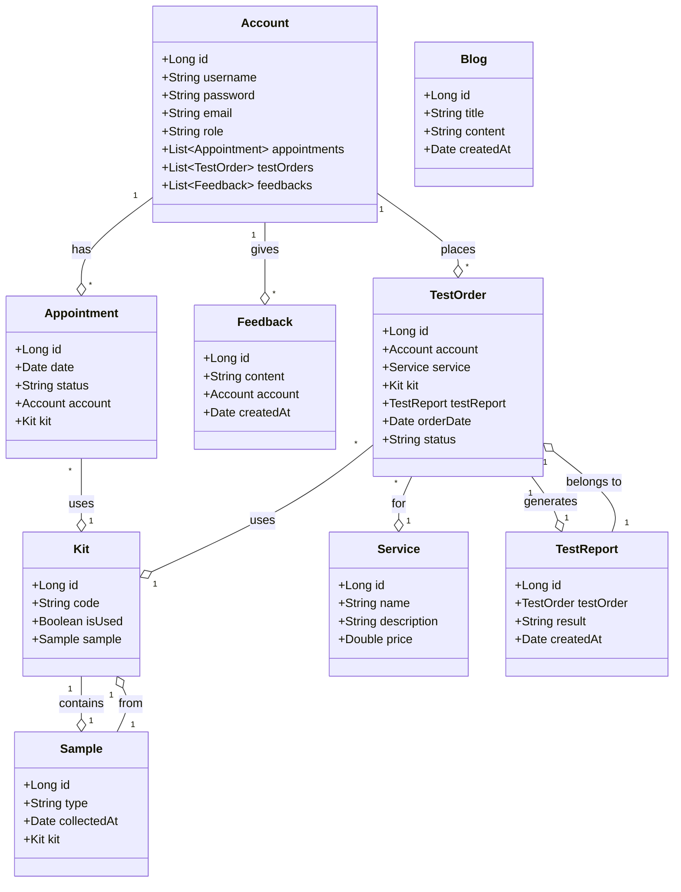

# Bloodline DNA Testing System - Class Diagram

Below is the class diagram representing the main entities and their relationships in the system:

```mermaid
classDiagram
    class Account {
        +Long id
        +String username
        +String password
        +String email
        +String role
        +List~Appointment~ appointments
        +List~TestOrder~ testOrders
        +List~Feedback~ feedbacks
    }
    class Appointment {
        +Long id
        +Date date
        +String status
        +Account account
        +Kit kit
    }
    class Blog {
        +Long id
        +String title
        +String content
        +Date createdAt
    }
    class Feedback {
        +Long id
        +String content
        +Account account
        +Date createdAt
    }
    class Kit {
        +Long id
        +String code
        +Boolean isUsed
        +Sample sample
    }
    class Sample {
        +Long id
        +String type
        +Date collectedAt
        +Kit kit
    }
    class Service {
        +Long id
        +String name
        +String description
        +Double price
    }
    class TestOrder {
        +Long id
        +Account account
        +Service service
        +Kit kit
        +TestReport testReport
        +Date orderDate
        +String status
    }
    class TestReport {
        +Long id
        +TestOrder testOrder
        +String result
        +Date createdAt
    }

    Account "1" --o "*" Appointment : has
    Account "1" --o "*" TestOrder : places
    Account "1" --o "*" Feedback : gives
    Appointment "*" --o "1" Kit : uses
    Kit "1" --o "1" Sample : contains
    TestOrder "*" --o "1" Service : for
    TestOrder "*" --o "1" Kit : uses
    TestOrder "1" --o "1" TestReport : generates
    TestReport "1" --o "1" TestOrder : belongs to
    Sample "1" --o "1" Kit : from
``` 