# Role-Based System Design Details

## System High-Level Design (Overall)

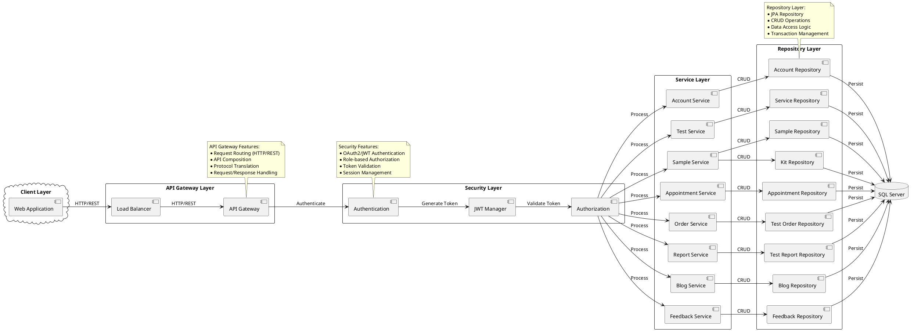

## State Diagrams

### Account Service State
Description: Manages user account lifecycle with security states and authentication flow.

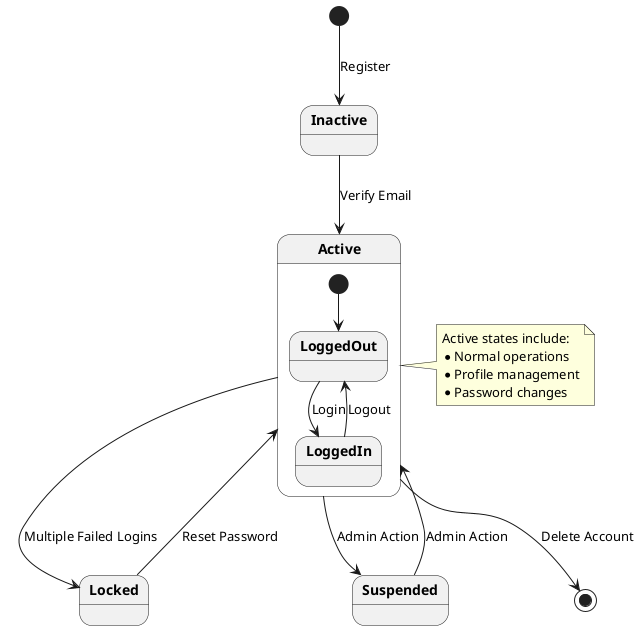

### Test Order Service State
Description: Orchestrates DNA testing workflow from order creation to result delivery.

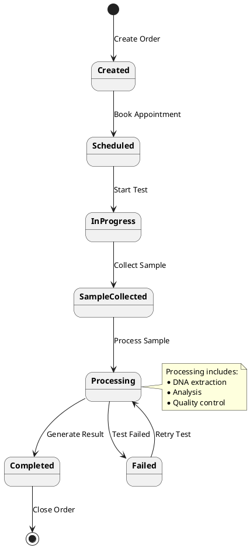

### Appointment Service State
Description: Handles scheduling process with confirmation, cancellation, and completion states.

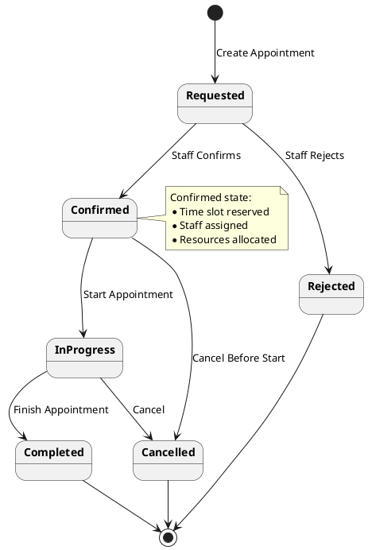

### Sample Service State
Description: Controls DNA sample handling from collection through testing to disposal.

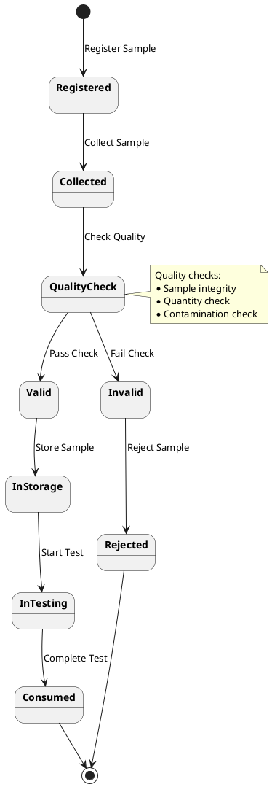

### Kit Service State
Description: Tracks testing kit lifecycle and allocation to test orders.

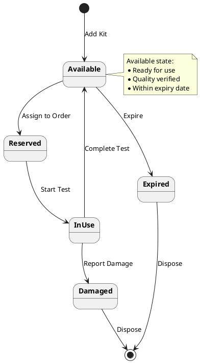

### Blog Service State
Description: Manages content workflow through draft, review, and publication states.

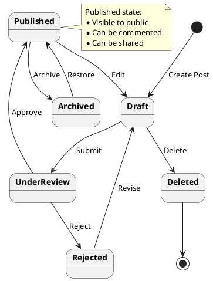

### Feedback Service State
Description: Processes customer feedback with review, escalation, and resolution states.

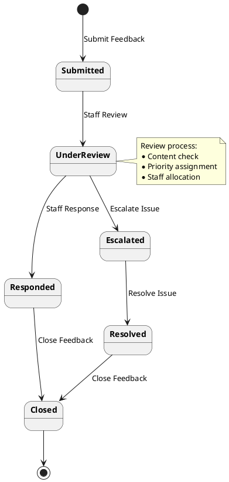

## 1. Customer Role

### 1.1 High-Level Design (Customer)

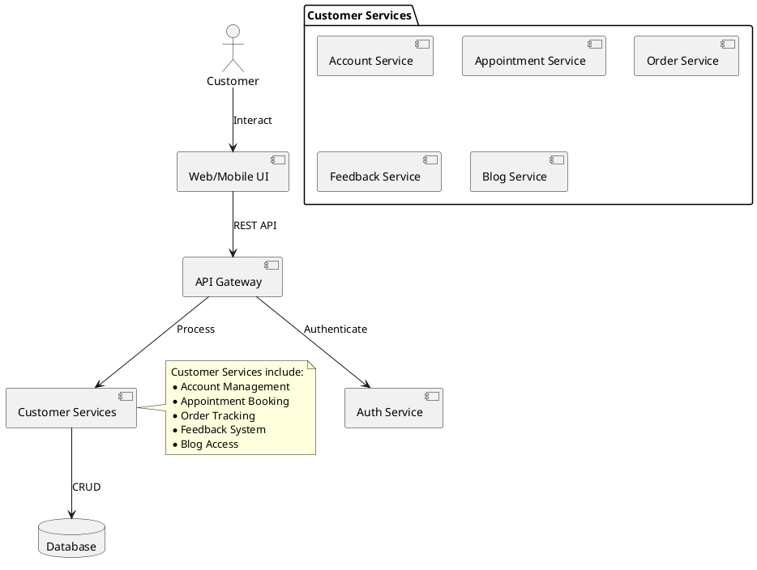

### 1.2 State Diagram (Customer Order)

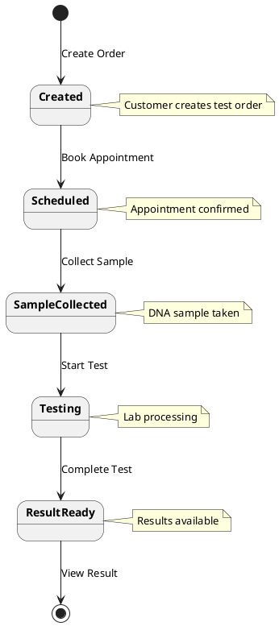

### 1.3 Communication Diagram (Customer)

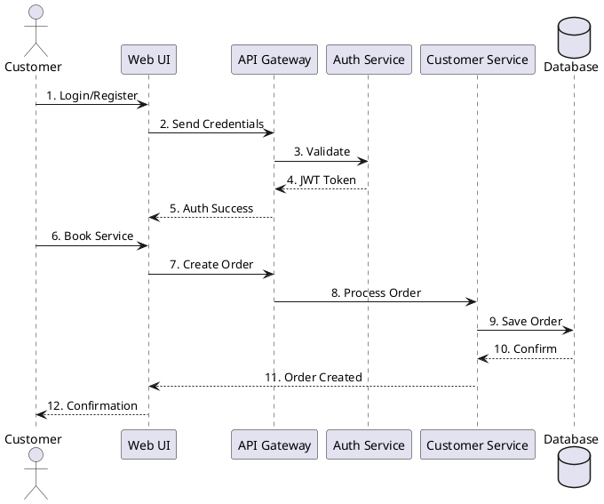

## 2. Staff Role

### 2.1 High-Level Design (Staff)

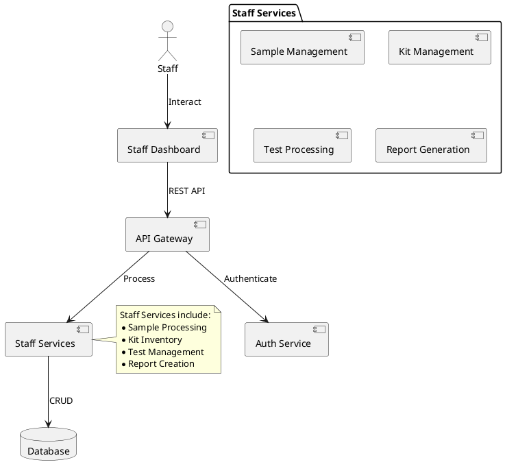

### 2.2 State Diagram (Sample Processing)

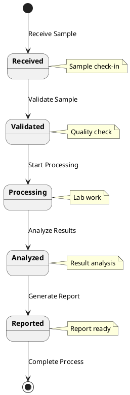

### 2.3 Communication Diagram (Staff)

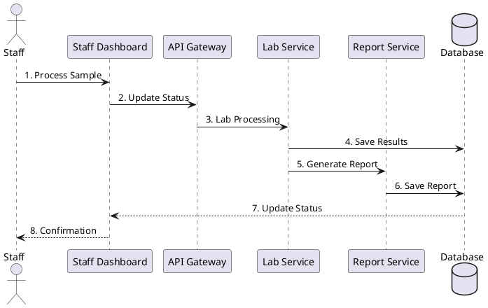

## 3. Admin Role

### 3.1 High-Level Design (Admin)

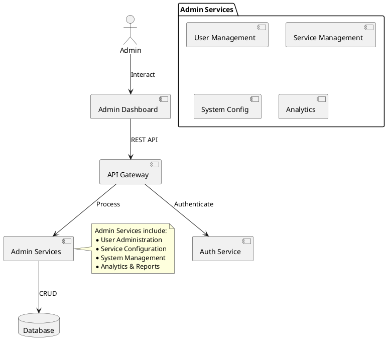

### 3.2 State Diagram (System Management)

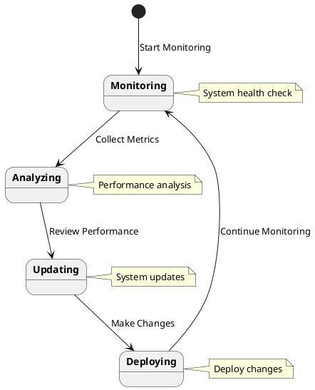

### 3.3 Communication Diagram (Admin)

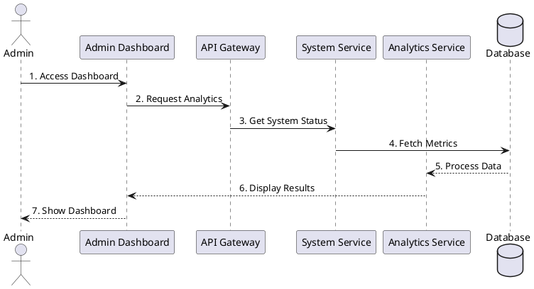

## 4. Integrated System Communication

### 4.1 Customer Communication Flow

```plantuml
@startuml
!define RECTANGLE class

actor "Customer" as customer
RECTANGLE "Web Portal" as portal
RECTANGLE "API Gateway" as gateway
RECTANGLE "Auth Service" as auth
RECTANGLE "Account Service" as account
RECTANGLE "Test Service" as test
RECTANGLE "Appointment Service" as appt
RECTANGLE "Result Service" as result
RECTANGLE "Notification Service" as notify
database "Database" as db

customer -> portal : 1. Access Portal
portal -> gateway : 2. API Request
gateway -> auth : 3. Authenticate
auth -> db : 4. Verify Credentials
db --> auth : 5. User Data
auth --> gateway : 6. JWT Token
gateway --> portal : 7. Auth Response

' Test Order Flow
customer -> portal : 8. Order Test
portal -> gateway : 9. Submit Order
gateway -> test : 10. Create Order
test -> db : 11. Save Order
test -> appt : 12. Schedule
appt -> db : 13. Save Appointment
test -> notify : 14. Send Confirmation
notify -> customer : 15. Email/SMS

' View Results Flow
customer -> portal : 16. Request Results
portal -> gateway : 17. Get Results
gateway -> result : 18. Fetch Results
result -> db : 19. Query Results
db --> result : 20. Result Data
result --> portal : 21. Display Results

note right of gateway
  Secure Communication:
  * JWT Authentication
  * Role Validation
  * Request Logging
end note

note right of notify
  Notifications:
  * Order Status
  * Appointments
  * Results Ready
end note

@enduml
```

### 4.2 Staff Communication Flow

```plantuml
@startuml
!define RECTANGLE class

actor "Lab Staff" as staff
RECTANGLE "Staff Dashboard" as dashboard
RECTANGLE "API Gateway" as gateway
RECTANGLE "Auth Service" as auth
RECTANGLE "Sample Service" as sample
RECTANGLE "Test Service" as test
RECTANGLE "QC Service" as qc
RECTANGLE "Report Service" as report
RECTANGLE "Kit Service" as kit
database "Database" as db

staff -> dashboard : 1. Login
dashboard -> gateway : 2. Auth Request
gateway -> auth : 3. Verify Staff
auth -> db : 4. Check Credentials
db --> auth : 5. Staff Data
auth --> gateway : 6. Staff Token
gateway --> dashboard : 7. Access Granted

' Sample Processing Flow
staff -> dashboard : 8. Scan Sample
dashboard -> gateway : 9. Get Sample Info
gateway -> sample : 10. Retrieve Data
sample -> db : 11. Query Sample
db --> sample : 12. Sample Details
sample -> kit : 13. Check Kit
kit -> db : 14. Assign Kit

' Test Processing Flow
staff -> dashboard : 15. Start Test
dashboard -> gateway : 16. Process Request
gateway -> test : 17. Begin Analysis
test -> qc : 18. Quality Check
qc -> db : 19. Save QC Results
test -> report : 20. Generate Report
report -> db : 21. Save Report

note right of gateway
  Lab Security:
  * Staff Authentication
  * Lab Access Control
  * Process Validation
end note

note right of qc
  Quality Control:
  * Sample Validation
  * Test Standards
  * Result Verification
end note

@enduml
```

### 4.3 Admin Communication Flow

```plantuml
@startuml
!define RECTANGLE class

actor "Admin" as admin
RECTANGLE "Admin Console" as console
RECTANGLE "API Gateway" as gateway
RECTANGLE "Auth Service" as auth
RECTANGLE "User Service" as user
RECTANGLE "Monitor Service" as monitor
RECTANGLE "Config Service" as config
RECTANGLE "Analytics Service" as analytics
RECTANGLE "Audit Service" as audit
database "Database" as db

admin -> console : 1. Access Console
console -> gateway : 2. Admin Auth
gateway -> auth : 3. Super Auth
auth -> db : 4. Verify Admin
db --> auth : 5. Admin Rights
auth --> gateway : 6. Admin Token
gateway --> console : 7. Full Access

' System Monitoring Flow
admin -> console : 8. Check System
console -> gateway : 9. Status Request
gateway -> monitor : 10. Get Metrics
monitor -> db : 11. Fetch Stats
db --> monitor : 12. System Data
monitor -> analytics : 13. Process Data
analytics --> console : 14. Display Stats

' User Management Flow
admin -> console : 15. Manage Users
console -> gateway : 16. User Request
gateway -> user : 17. User Operation
user -> db : 18. Update Users
user -> audit : 19. Log Changes
audit -> db : 20. Save Audit

' Configuration Flow
admin -> console : 21. Update Config
console -> gateway : 22. Config Change
gateway -> config : 23. Apply Changes
config -> db : 24. Save Config
config -> audit : 25. Log Update

note right of gateway
  Admin Control:
  * Super User Auth
  * Full System Access
  * Audit Logging
end note

note right of audit
  System Audit:
  * User Actions
  * System Changes
  * Security Events
end note

@enduml
```

### 4.4 Giải Thích Luồng Giao Tiếp

#### 1. Luồng Giao Tiếp Khách Hàng
- **Xác Thực và Đăng Nhập:**
  - Truy cập portal và xác thực qua API Gateway
  - Nhận JWT token cho các thao tác tiếp theo
  - Kiểm tra quyền truy cập theo role

- **Quy Trình Đặt Xét Nghiệm:**
  - Tạo đơn xét nghiệm qua Test Service
  - Đặt lịch hẹn thông qua Appointment Service
  - Nhận thông báo xác nhận qua Notification Service

- **Xem Kết Quả:**
  - Truy vấn kết quả từ Result Service
  - Hiển thị dữ liệu an toàn qua portal
  - Nhận thông báo khi có kết quả mới

#### 2. Luồng Giao Tiếp Nhân Viên
- **Quản Lý Mẫu:**
  - Quét và xác thực mẫu
  - Kiểm tra và gán kit xét nghiệm
  - Cập nhật trạng thái mẫu

- **Xử Lý Xét Nghiệm:**
  - Thực hiện quy trình xét nghiệm
  - Kiểm tra chất lượng qua QC Service
  - Tạo báo cáo kết quả

- **Quản Lý Chất Lượng:**
  - Validation mẫu xét nghiệm
  - Kiểm tra tiêu chuẩn
  - Xác minh kết quả

#### 3. Luồng Giao Tiếp Admin
- **Quản Lý Hệ Thống:**
  - Giám sát metrics realtime
  - Phân tích dữ liệu hệ thống
  - Cấu hình và tối ưu

- **Quản Lý Người Dùng:**
  - CRUD operations người dùng
  - Phân quyền và role
  - Audit log mọi thay đổi

- **Cấu Hình Hệ Thống:**
  - Cập nhật cài đặt
  - Theo dõi thay đổi
  - Ghi log audit

#### Đặc Điểm Chung
1. **Bảo Mật:**
   - Xác thực nhiều lớp
   - Phân quyền chi tiết
   - Audit logging

2. **Giao Tiếp:**
   - API Gateway tập trung
   - Microservices độc lập
   - Async messaging

3. **Dữ Liệu:**
   - CQRS pattern
   - Event sourcing
   - Data consistency

## 5. Detailed Sequence Diagrams

### 5.1 Customer DNA Test Order Flow

```plantuml
@startuml
actor Customer
participant "Web Portal" as Portal
participant "API Gateway" as Gateway
participant "Auth Service" as Auth
participant "Order Service" as Order
participant "Appointment Service" as Appt
participant "Sample Service" as Sample
participant "Test Service" as Test
participant "Report Service" as Report
database "Database" as DB

Customer -> Portal : 1. Login
Portal -> Gateway : 2. Send Credentials
Gateway -> Auth : 3. Authenticate
Auth -> DB : 4. Verify Credentials
DB --> Auth : 5. Return User Data
Auth --> Gateway : 6. Generate JWT Token
Gateway --> Portal : 7. Return Token
Portal --> Customer : 8. Show Dashboard

Customer -> Portal : 9. Create Test Order
Portal -> Gateway : 10. Submit Order Request
Gateway -> Auth : 11. Validate Token
Auth --> Gateway : 12. Token Valid
Gateway -> Order : 13. Create Order
Order -> DB : 14. Save Order
DB --> Order : 15. Order Created
Order -> Appt : 16. Schedule Appointment
Appt -> DB : 17. Save Appointment
DB --> Appt : 18. Appointment Confirmed
Appt --> Order : 19. Return Appointment Details
Order --> Gateway : 20. Return Order Status
Gateway --> Portal : 21. Show Order Confirmation
Portal --> Customer : 22. Display Order & Appointment Details

== Sample Collection Day ==

Customer -> Portal : 23. Arrive for Appointment
Portal -> Gateway : 24. Update Appointment Status
Gateway -> Appt : 25. Start Appointment
Appt -> Sample : 26. Register Sample
Sample -> DB : 27. Save Sample Data
DB --> Sample : 28. Sample Registered
Sample --> Appt : 29. Sample Ready
Appt -> Test : 30. Start Testing Process
Test -> DB : 31. Update Test Status
DB --> Test : 32. Status Updated
Test --> Gateway : 33. Return Status
Gateway --> Portal : 34. Show Processing Status
Portal --> Customer : 35. Display "Sample Collected"

== Test Processing ==

Test -> Sample : 36. Process Sample
Sample -> Test : 37. Analysis Complete
Test -> Report : 38. Generate Report
Report -> DB : 39. Save Report
DB --> Report : 40. Report Saved
Report --> Test : 41. Report Ready
Test --> Gateway : 42. Test Complete
Gateway --> Portal : 43. Results Ready
Portal --> Customer : 44. Notify Results Available

@enduml

### 5.2 Staff Sample Processing Flow

```plantuml
@startuml
actor "Lab Staff" as Staff
participant "Staff Dashboard" as Dashboard
participant "API Gateway" as Gateway
participant "Auth Service" as Auth
participant "Sample Service" as Sample
participant "Test Service" as Test
participant "Kit Service" as Kit
participant "Report Service" as Report
database "Database" as DB

Staff -> Dashboard : 1. Login
Dashboard -> Gateway : 2. Send Credentials
Gateway -> Auth : 3. Authenticate
Auth -> DB : 4. Verify Staff Credentials
DB --> Auth : 5. Return Staff Data
Auth --> Gateway : 6. Generate JWT Token
Gateway --> Dashboard : 7. Return Token
Dashboard --> Staff : 8. Show Lab Dashboard

Staff -> Dashboard : 9. Scan Sample Barcode
Dashboard -> Gateway : 10. Get Sample Info
Gateway -> Sample : 11. Retrieve Sample Data
Sample -> DB : 12. Query Sample
DB --> Sample : 13. Return Sample Details
Sample --> Gateway : 14. Sample Information
Gateway --> Dashboard : 15. Display Sample Details

Staff -> Dashboard : 16. Start Processing
Dashboard -> Gateway : 17. Update Sample Status
Gateway -> Sample : 18. Begin Processing
Sample -> Kit : 19. Assign Test Kit
Kit -> DB : 20. Update Kit Status
DB --> Kit : 21. Kit Assigned
Kit --> Sample : 22. Kit Ready
Sample -> Test : 23. Start Analysis
Test -> DB : 24. Update Test Status
DB --> Test : 25. Status Updated

== Analysis Process ==

Test -> Sample : 26. Extract DNA
Sample -> Test : 27. DNA Ready
Test -> Sample : 28. Run Tests
Sample -> Test : 29. Tests Complete
Test -> Report : 30. Generate Results
Report -> DB : 31. Save Results
DB --> Report : 32. Results Saved
Report --> Test : 33. Report Generated
Test --> Gateway : 34. Processing Complete
Gateway --> Dashboard : 35. Update Status
Dashboard --> Staff : 36. Show Completion

@enduml

### 5.3 Admin System Management Flow

```plantuml
@startuml
actor Admin
participant "Admin Console" as Console
participant "API Gateway" as Gateway
participant "Auth Service" as Auth
participant "User Service" as User
participant "System Service" as System
participant "Analytics Service" as Analytics
database "Database" as DB

Admin -> Console : 1. Login
Console -> Gateway : 2. Send Admin Credentials
Gateway -> Auth : 3. Authenticate
Auth -> DB : 4. Verify Admin Access
DB --> Auth : 5. Return Admin Data
Auth --> Gateway : 6. Generate Admin Token
Gateway --> Console : 7. Return Token
Console --> Admin : 8. Show Admin Dashboard

== System Monitoring ==

Admin -> Console : 9. Request System Status
Console -> Gateway : 10. Get System Metrics
Gateway -> System : 11. Fetch Metrics
System -> DB : 12. Query Performance Data
DB --> System : 13. Return Metrics
System -> Analytics : 14. Process Metrics
Analytics --> System : 15. Analysis Results
System --> Gateway : 16. System Status
Gateway --> Console : 17. Display Metrics
Console --> Admin : 18. Show System Health

== User Management ==

Admin -> Console : 19. View User Reports
Console -> Gateway : 20. Request User Data
Gateway -> User : 21. Get User Statistics
User -> DB : 22. Query User Data
DB --> User : 23. Return User Stats
User -> Analytics : 24. Generate Reports
Analytics --> User : 25. User Analysis
User --> Gateway : 26. User Reports
Gateway --> Console : 27. Display Reports
Console --> Admin : 28. Show User Dashboard

== System Updates ==

Admin -> Console : 29. Initialize Update
Console -> Gateway : 30. Request Update
Gateway -> System : 31. Start Update Process
System -> DB : 32. Backup Data
DB --> System : 33. Backup Complete
System -> System : 34. Apply Updates
System -> DB : 35. Update Configs
DB --> System : 36. Configs Updated
System --> Gateway : 37. Update Complete
Gateway --> Console : 38. Update Status
Console --> Admin : 39. Show Success

@enduml
```

## Chi tiết Luồng Xử Lý

### 1. Customer Flow

- Đăng nhập/Đăng ký qua Customer Portal
- Xác thực thông qua JWT
- Truy cập các dịch vụ khách hàng
- Tương tác với database thông qua Customer Services

### 2. Staff Flow

- Đăng nhập vào Staff Dashboard
- Xử lý mẫu và cập nhật trạng thái
- Tạo báo cáo và quản lý kit
- Tương tác với Test DB và System DB

### 3. Admin Flow

- Quản lý toàn bộ hệ thống qua Admin Console
- Giám sát và phân tích hệ thống
- Cấu hình và quản lý người dùng
- Truy cập đầy đủ vào tất cả databases

### 4. Security & Integration

- Xác thực tập trung qua API Gateway
- Phân quyền dựa trên role
- Logging và monitoring tập trung
- Shared services cho các chức năng chung

## 6. Detailed Component Diagrams

### 6.1 Overall System Components

```plantuml
@startuml
skinparam componentStyle uml2
skinparam component {
    BackgroundColor<<Frontend>> LightBlue
    BackgroundColor<<Service>> LightGreen
    BackgroundColor<<Infrastructure>> LightGray
    BackgroundColor<<Database>> LightYellow
}

package "Client Layer" <<Frontend>> {
    component "Customer Portal" as CP {
        component "Authentication Module" as CPAuth
        component "Test Order Module" as CPOrder
        component "Appointment Module" as CPAppt
        component "Results Viewer" as CPResults
    }
    
    component "Staff Dashboard" as SD {
        component "Sample Management" as SDSample
        component "Test Processing" as SDTest
        component "Kit Management" as SDKit
        component "Report Generation" as SDReport
    }
    
    component "Admin Console" as AC {
        component "User Management" as ACUser
        component "System Monitoring" as ACMonitor
        component "Configuration" as ACConfig
        component "Analytics Dashboard" as ACAnalytics
    }
}

package "API Gateway Layer" <<Infrastructure>> {
    component "Load Balancer" as LB
    component "API Gateway" as Gateway {
        component "Route Handler" as GWRoute
        component "Auth Middleware" as GWAuth
        component "Rate Limiter" as GWRate
        component "Request Logger" as GWLog
    }
}

package "Security Layer" <<Infrastructure>> {
    component "Authentication Service" as Auth {
        component "JWT Manager" as AuthJWT
        component "OAuth Provider" as AuthOAuth
        component "Password Manager" as AuthPwd
    }
    
    component "Authorization Service" as Authz {
        component "Role Manager" as AuthzRole
        component "Permission Handler" as AuthzPerm
        component "Policy Enforcer" as AuthzPolicy
    }
}

package "Core Services" <<Service>> {
    component "Account Service" as AS {
        component "User Manager" as ASUser
        component "Profile Manager" as ASProfile
        component "Settings Handler" as ASSettings
    }
    
    component "Test Service" as TS {
        component "Test Processor" as TSProc
        component "Quality Control" as TSQC
        component "Result Manager" as TSResult
    }
    
    component "Sample Service" as SS {
        component "Sample Tracker" as SSTrack
        component "DNA Extractor" as SSDNA
        component "Storage Manager" as SSStorage
    }
    
    component "Appointment Service" as APS {
        component "Schedule Manager" as APSSchedule
        component "Notification Handler" as APSNotify
        component "Resource Allocator" as APSResource
    }
}

package "Support Services" <<Service>> {
    component "Report Service" as RS {
        component "Report Generator" as RSGen
        component "PDF Creator" as RSPDF
        component "Data Visualizer" as RSVis
    }
    
    component "Notification Service" as NS {
        component "Email Handler" as NSEmail
        component "SMS Handler" as NSSMS
        component "Push Notifier" as NSPush
    }
    
    component "Analytics Service" as ANS {
        component "Data Processor" as ANSProc
        component "Metrics Collector" as ANSMetrics
        component "Report Builder" as ANSReport
    }
}

package "Data Layer" <<Database>> {
    database "User Database" as UserDB {
        component "User Tables" as UserTables
        component "Profile Data" as ProfileData
        component "Auth Data" as AuthData
    }
    
    database "Test Database" as TestDB {
        component "Test Records" as TestRecords
        component "Sample Data" as SampleData
        component "Results Data" as ResultsData
    }
    
    database "System Database" as SysDB {
        component "Config Data" as ConfigData
        component "Audit Logs" as AuditLogs
        component "Metrics Data" as MetricsData
    }
}

' Client Layer Connections
CP ..> Gateway : HTTPS
SD ..> Gateway : HTTPS
AC ..> Gateway : HTTPS

' Gateway Layer Connections
Gateway ..> Auth : Authenticate
Gateway ..> Authz : Authorize
LB ..> Gateway : Route

' Service Layer Connections
Auth ..> UserDB : Read/Write
Authz ..> UserDB : Read

AS ..> UserDB : CRUD
TS ..> TestDB : CRUD
SS ..> TestDB : CRUD
APS ..> TestDB : CRUD

RS ..> TestDB : Read
RS ..> UserDB : Read
ANS ..> SysDB : CRUD
NS ..> UserDB : Read

' Cross-Service Communications
TS ..> SS : Use
TS ..> RS : Generate
APS ..> NS : Notify
AS ..> NS : Alert

note right of CP
  Customer Portal provides:
  - Test ordering
  - Appointment booking
  - Result viewing
  - Profile management
end note

note right of SD
  Staff Dashboard enables:
  - Sample processing
  - Test management
  - Kit tracking
  - Report generation
end note

note right of AC
  Admin Console provides:
  - System monitoring
  - User management
  - Configuration
  - Analytics
end note

note right of Gateway
  API Gateway handles:
  - Authentication
  - Authorization
  - Rate limiting
  - Request routing
  - Logging
end note

@enduml

### 6.2 Service Dependencies

```plantuml
@startuml
skinparam componentStyle uml2

interface "HTTP/REST" as HTTP
interface "Message Queue" as MQ
interface "Database Access" as DB
interface "File Storage" as FS

component "API Gateway" as Gateway
component "Authentication" as Auth
component "Authorization" as Authz

component "Account Service" as AS
component "Test Service" as TS
component "Sample Service" as SS
component "Appointment Service" as APS
component "Report Service" as RS
component "Notification Service" as NS
component "Analytics Service" as ANS

database "Databases" as DBS
queue "Message Broker" as MB
storage "File System" as FILES

Gateway -- HTTP
Auth -- HTTP
Authz -- HTTP

AS -- DB
TS -- DB
SS -- DB
APS -- DB
RS -- DB
ANS -- DB

NS -- MQ
RS -- MQ
APS -- MQ

RS -- FS
SS -- FS

DBS -- DB
MB -- MQ
FILES -- FS

Gateway ..> Auth : uses
Gateway ..> Authz : uses
TS ..> SS : depends
TS ..> RS : depends
APS ..> NS : depends
AS ..> NS : depends
RS ..> ANS : depends

note right of HTTP
  REST APIs:
  - JSON/HTTP
  - JWT Auth
  - Rate Limited
end note

note right of MQ
  Async Communication:
  - Notifications
  - Reports
  - Analytics
end note

note right of DB
  Data Access:
  - CRUD Operations
  - Transactions
  - Audit Logging
end note

note right of FS
  File Storage:
  - Reports
  - Test Results
  - Samples Data
end note

@enduml
```

## Giải Thích Chi Tiết Sơ Đồ Component

### 6.3 Giải Thích Các Thành Phần Chính

#### 1. Tầng Giao Diện (Client Layer)
- **Cổng Khách Hàng (Customer Portal)**
  - Module Xác Thực: Quản lý đăng nhập và bảo mật người dùng
  - Module Đặt Xét Nghiệm: Xử lý quy trình đặt xét nghiệm DNA
  - Module Lịch Hẹn: Quản lý đặt và theo dõi lịch hẹn
  - Trình Xem Kết Quả: Hiển thị kết quả xét nghiệm

- **Bảng Điều Khiển Nhân Viên (Staff Dashboard)**
  - Quản Lý Mẫu: Theo dõi và xử lý mẫu xét nghiệm
  - Xử Lý Xét Nghiệm: Quy trình phân tích DNA
  - Quản Lý Kit: Theo dõi và quản lý bộ kit xét nghiệm
  - Tạo Báo Cáo: Tổng hợp và xuất báo cáo kết quả

- **Bảng Điều Khiển Admin (Admin Console)**
  - Quản Lý Người Dùng: Kiểm soát tài khoản và phân quyền
  - Giám Sát Hệ Thống: Theo dõi hiệu suất và trạng thái
  - Cấu Hình: Thiết lập và tùy chỉnh hệ thống
  - Bảng Phân Tích: Thống kê và báo cáo tổng quan

#### 2. Tầng API Gateway
- **Cân Bằng Tải (Load Balancer)**
  - Phân phối lưu lượng truy cập
  - Đảm bảo hiệu suất và độ tin cậy

- **API Gateway**
  - Xử Lý Route: Điều hướng yêu cầu đến service phù hợp
  - Middleware Xác Thực: Kiểm tra và xác thực người dùng
  - Giới Hạn Tốc Độ: Kiểm soát số lượng request
  - Ghi Log: Theo dõi và lưu trữ lịch sử truy cập

#### 3. Tầng Bảo Mật (Security Layer)
- **Dịch Vụ Xác Thực (Authentication Service)**
  - Quản Lý JWT: Tạo và xác thực token
  - OAuth Provider: Hỗ trợ đăng nhập bên thứ ba
  - Quản Lý Mật Khẩu: Bảo mật thông tin đăng nhập

- **Dịch Vụ Phân Quyền (Authorization Service)**
  - Quản Lý Vai Trò: Phân định quyền hạn người dùng
  - Xử Lý Quyền: Kiểm tra và cấp quyền truy cập
  - Thực Thi Chính Sách: Áp dụng quy tắc bảo mật

#### 4. Dịch Vụ Cốt Lõi (Core Services)
- **Dịch Vụ Tài Khoản (Account Service)**
  - Quản lý thông tin người dùng
  - Cập nhật hồ sơ cá nhân
  - Xử lý cài đặt người dùng

- **Dịch Vụ Xét Nghiệm (Test Service)**
  - Xử lý quy trình xét nghiệm
  - Kiểm soát chất lượng
  - Quản lý kết quả

- **Dịch Vụ Mẫu (Sample Service)**
  - Theo dõi mẫu xét nghiệm
  - Trích xuất DNA
  - Quản lý lưu trữ mẫu

- **Dịch Vụ Lịch Hẹn (Appointment Service)**
  - Quản lý lịch trình
  - Gửi thông báo
  - Phân bổ nguồn lực

#### 5. Dịch Vụ Hỗ Trợ (Support Services)
- **Dịch Vụ Báo Cáo (Report Service)**
  - Tạo báo cáo kết quả
  - Xuất file PDF
  - Hiển thị dữ liệu trực quan

- **Dịch Vụ Thông Báo (Notification Service)**
  - Gửi email
  - Gửi SMS
  - Thông báo đẩy

- **Dịch Vụ Phân Tích (Analytics Service)**
  - Xử lý dữ liệu
  - Thu thập số liệu
  - Tạo báo cáo thống kê

#### 6. Tầng Dữ Liệu (Data Layer)
- **Cơ Sở Dữ Liệu Người Dùng (User Database)**
  - Bảng người dùng
  - Dữ liệu hồ sơ
  - Thông tin xác thực

- **Cơ Sở Dữ Liệu Xét Nghiệm (Test Database)**
  - Hồ sơ xét nghiệm
  - Dữ liệu mẫu
  - Kết quả xét nghiệm

- **Cơ Sở Dữ Liệu Hệ Thống (System Database)**
  - Dữ liệu cấu hình
  - Nhật ký hệ thống
  - Số liệu thống kê

### 6.4 Tương Tác Giữa Các Service

#### 1. Giao Thức Giao Tiếp
- **HTTP/REST API**
  - Sử dụng JSON cho dữ liệu
  - Xác thực qua JWT
  - Có giới hạn tốc độ truy cập

- **Message Queue**
  - Xử lý thông báo
  - Tạo báo cáo bất đồng bộ
  - Phân tích dữ liệu

- **Truy Cập Database**
  - Thao tác CRUD
  - Quản lý giao dịch
  - Ghi log hoạt động

- **Lưu Trữ File**
  - Lưu trữ báo cáo
  - Kết quả xét nghiệm
  - Dữ liệu mẫu

#### 2. Phụ Thuộc Service
- Test Service phụ thuộc vào Sample Service và Report Service
- Appointment Service sử dụng Notification Service
- Account Service kết nối với Notification Service
- Report Service tích hợp với Analytics Service

#### 3. Luồng Dữ Liệu
- Tất cả request đều qua API Gateway
- Xác thực và phân quyền được kiểm tra tại Security Layer
- Dữ liệu được lưu trữ phân tán trong các database chuyên biệt
- File được quản lý riêng trong hệ thống lưu trữ
