# Role-Based System Design Details

## System High-Level Design (Overall)

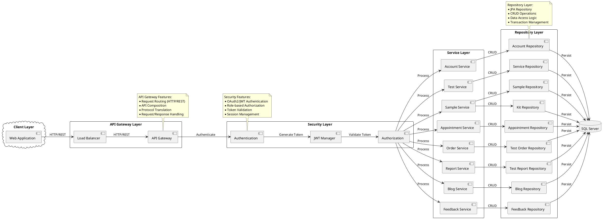

## State Diagrams

### Account Service State
Description: Manages user account lifecycle with security states and authentication flow.

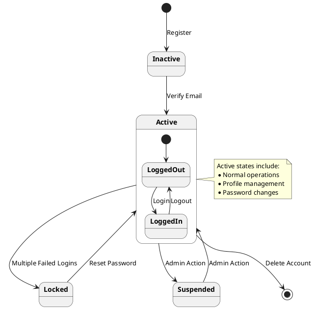

### Test Order Service State
Description: Orchestrates DNA testing workflow from order creation to result delivery.

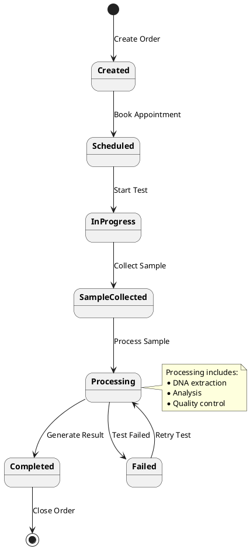

### Appointment Service State
Description: Handles scheduling process with confirmation, cancellation, and completion states.

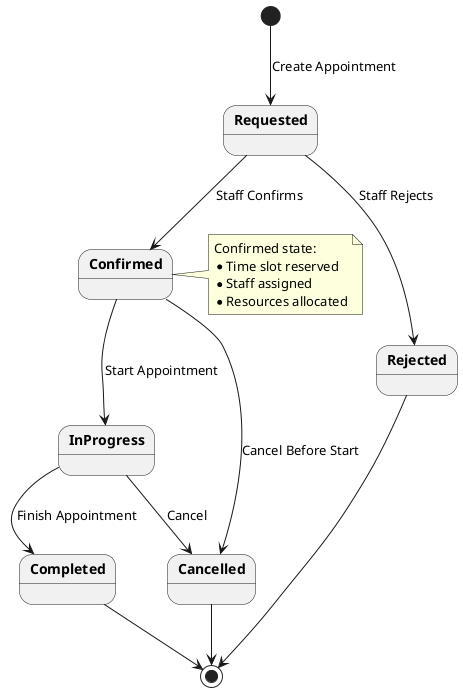

### Sample Service State
Description: Controls DNA sample handling from collection through testing to disposal.

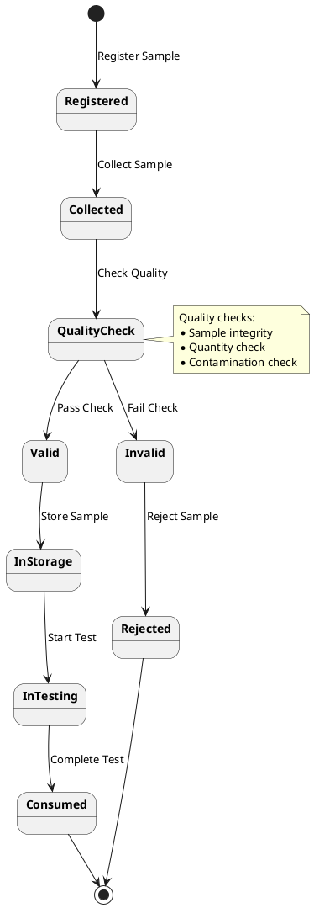

### Kit Service State
Description: Tracks testing kit lifecycle and allocation to test orders.

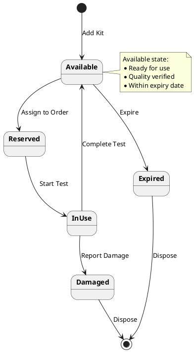

### Blog Service State
Description: Manages content workflow through draft, review, and publication states.

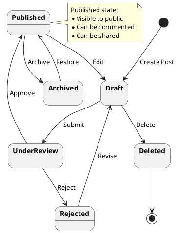

### Feedback Service State
Description: Processes customer feedback with review, escalation, and resolution states.

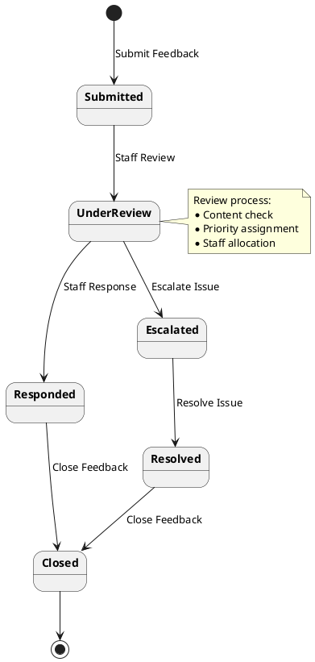

## 1. Customer Role

### 1.1 High-Level Design (Customer)

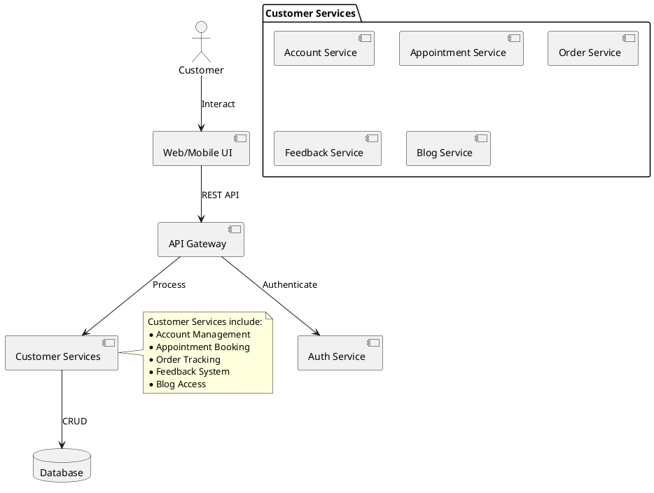

### 1.2 State Diagram (Customer Order)

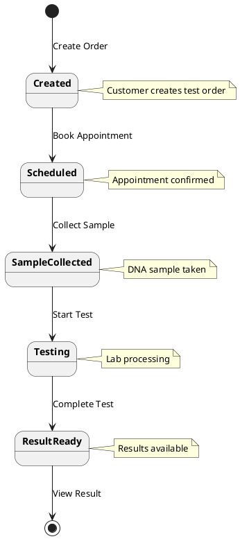

### 1.3 Communication Diagram (Customer)

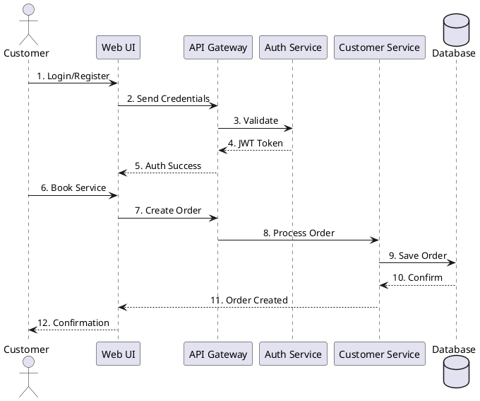

## 2. Staff Role

### 2.1 High-Level Design (Staff)

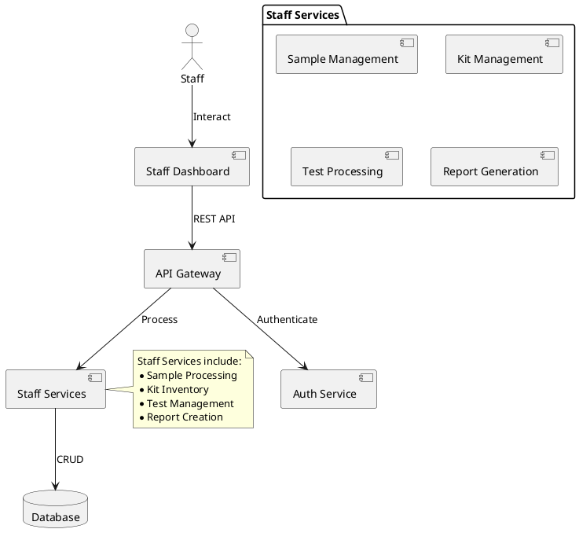

### 2.2 State Diagram (Sample Processing)

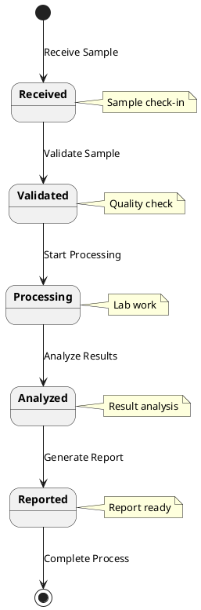

### 2.3 Communication Diagram (Staff)

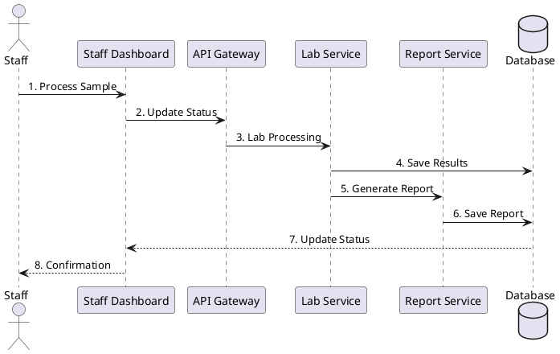

## 3. Admin Role

### 3.1 High-Level Design (Admin)

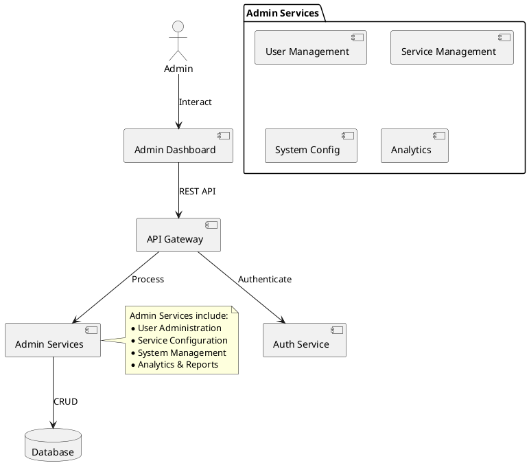

### 3.2 State Diagram (System Management)

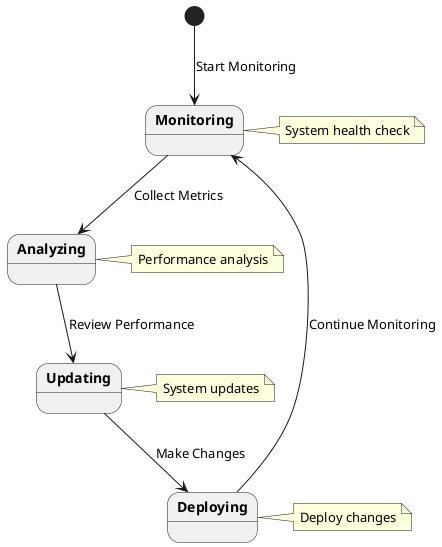

### 3.3 Communication Diagram (Admin)

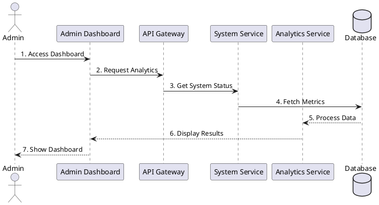

## 4. Integrated System Communication

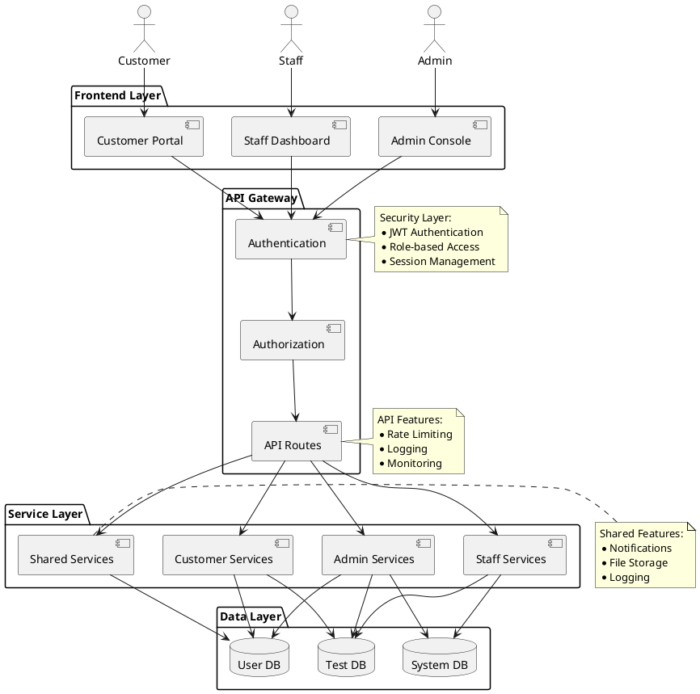

## 5. Detailed Sequence Diagrams

### 5.1 Customer DNA Test Order Flow

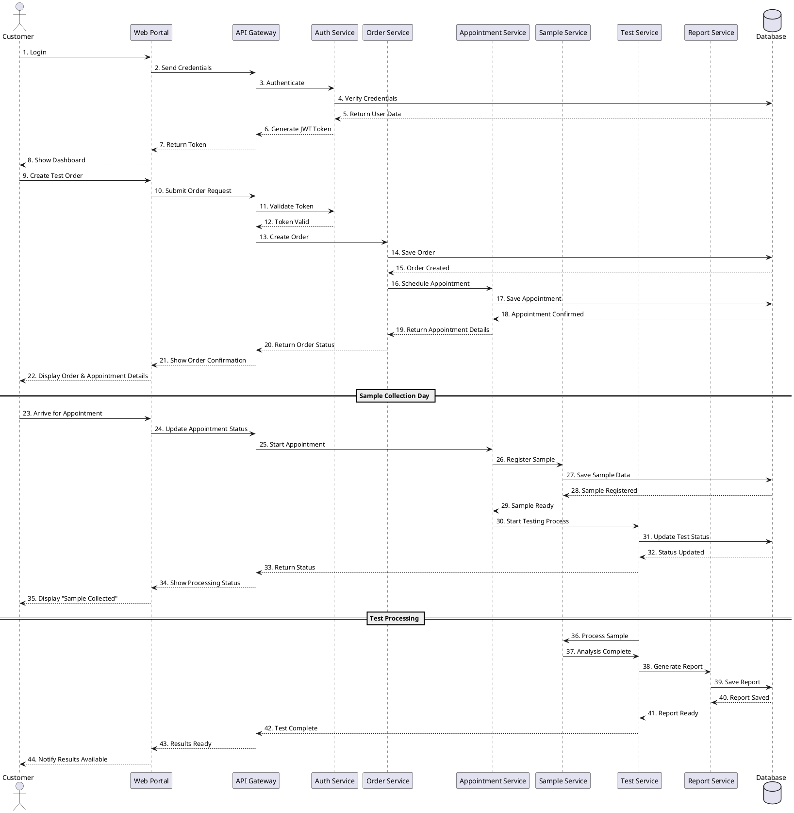

## Chi tiết Luồng Xử Lý

### 1. Customer Flow

- Đăng nhập/Đăng ký qua Customer Portal
- Xác thực thông qua JWT
- Truy cập các dịch vụ khách hàng
- Tương tác với database thông qua Customer Services

### 2. Staff Flow

- Đăng nhập vào Staff Dashboard
- Xử lý mẫu và cập nhật trạng thái
- Tạo báo cáo và quản lý kit
- Tương tác với Test DB và System DB

### 3. Admin Flow

- Quản lý toàn bộ hệ thống qua Admin Console
- Giám sát và phân tích hệ thống
- Cấu hình và quản lý người dùng
- Truy cập đầy đủ vào tất cả databases

### 4. Security & Integration

- Xác thực tập trung qua API Gateway
- Phân quyền dựa trên role
- Logging và monitoring tập trung
- Shared services cho các chức năng chung
