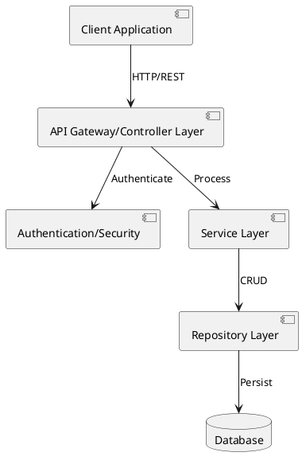
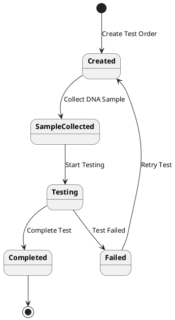
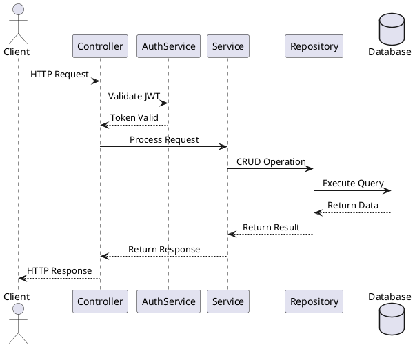
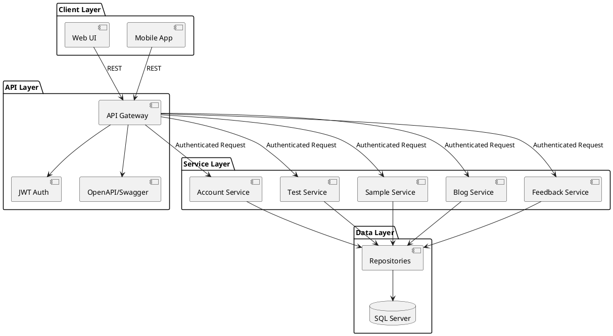

# System Design Documentation

## 1. System High-Level Design

## 2. State Diagram for Test Order Process

## 3. Communication Diagram

## 4. Integrated Communication Diagram

## Mô tả chi tiết

### 1. System High-Level Design
- Kiến trúc nhiều lớp (Layered Architecture)
- Sử dụng REST API để giao tiếp
- JWT Authentication cho bảo mật
- Repository pattern cho tương tác database

### 2. State Diagram
- Mô tả quy trình xét nghiệm ADN từ lúc tạo đơn đến hoàn thành
- Các trạng thái chính: Created, SampleCollected, Testing, Completed, Failed
- Cho phép retry khi test thất bại

### 3. Communication Diagram
- Luồng xử lý request từ client đến database và ngược lại
- Tích hợp JWT authentication
- Xử lý đồng bộ theo tuần tự

### 4. Integrated Communication
- Tích hợp đầy đủ các thành phần của hệ thống
- Phân chia rõ ràng các layer
- Hiển thị luồng dữ liệu và tương tác giữa các service 